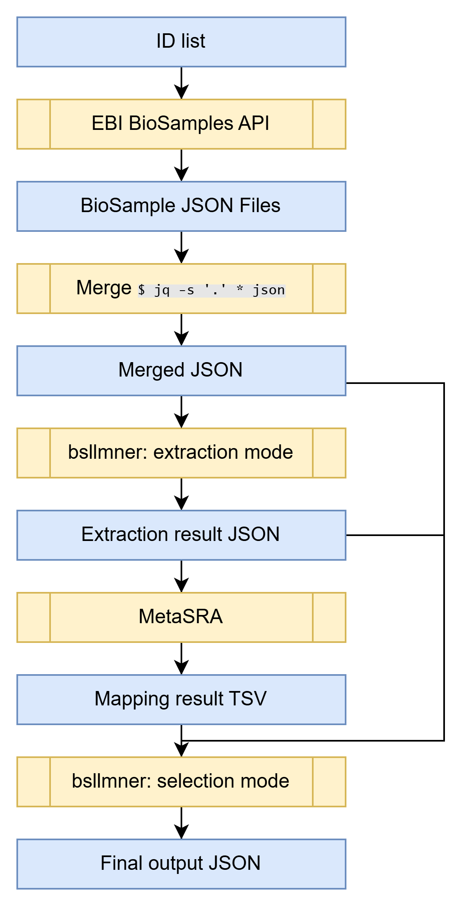

# bsllmner
Named Entity Recogniton (NER) of biological terms in BioSample records using LLMs

## Usage
### Setup ollama
See also the [documentation by ollama](https://hub.docker.com/r/ollama/ollama)
```sh
docker pull ollama/ollama:0.5.4
docker run -d --gpus=all -v ollama:/root/.ollama -p 11434:11434 --name ollama ollama/ollama:0.5.4
docker exec ollama ollama pull llama3.1:70b
```

### Setup Docker network to enable access to ollama from other containers
```sh
docker network create network_ollama
docker network connect network_ollama ollama
```

### Prepare bsllmner
```sh
docker pull shikeda/bsllmner:latest
```

### Extraction mode
In the extraction mode, the program extracts strings of a specified type from the input json. The detail is defined in the prompt. As a common procedure, an input JSON object, which is given as an item in the JSON list provided as the input, is appended to the last prompt.
```sh
docker run --rm --network network_ollama -v `pwd`:/data/ shikeda/bsllmner:latest -m llama3.1:70b -i 5,2,6,7 -v -u http://ollama:11434 extract /data/input.json
```
- `-m llama3.1:70b`: Specify LLM model
- `-i 5,2,6,7`: Specify the prompt indices. Each number corresponds to an index number of a prompt defined in `bsllmner/prompt/prompt.yaml`. The input to LLM is constructed as the array in this order. If you want to use a customized prompt, you can specify a yaml file with the `-p` option.
- `-v`: display progress
- `-u http://ollama:11434`: Specify the URL of ollama server
- `extract`: Extraction mode
- `/data/input.json`: input json

The input json is like below. For each sample, the `accession` attribute is required as the identifier of the sample.
```json
[
  {
    "accession": "SAMD00123367",
    "cell line": "H1299",
    "organism": "Homo sapiens",
    "sample name": "ATAC-seq_H1299_48h_G11_GSK1210151A (Inhibitor_BET)_0.1",
    "title": "ATAC-seq_H1299_48h_G11_GSK1210151A (Inhibitor_BET)_0.1"
  },
  {
    "accession": "SAMD00235411",
    "cell line": "SKNO-1",
    "organism": "Homo sapiens",
    "phenotype": "shRNA_2 against human KDM4B",
    "sample name": "SKNO1 4B sh2",
    "title": "ATAC-seq 4B sh2"
  }
]
```
Also, the list of json output by the EBI BioSamples API ([example](https://www.ebi.ac.uk/biosamples/samples/SAMN13719297.json)) is also available.
```json
[
  {
    "accession": "SAMD00123367",
    "taxId": 9606,
    "characteristics": {
      "cell line": [{"text": "H1299"}],
      "organism": [{"text":"Homo sapiens"}],
      "sample name": [{"text": "ATAC-seq_H1299_48h_G11_GSK1210151A (Inhibitor_BET)_0.1"}],
      "title": [{"text": "ATAC-seq_H1299_48h_G11_GSK1210151A (Inhibitor_BET)_0.1"}]
    }
  }
]
```

The result is output as json-lines like below. The `output_full` attribute contains the raw output of LLM for the sample. The conclusion of LLM is assumed to be JSON format and is output as the `output` value.
```json
{"accession": "SAMD00123367", "characteristics": {"cell_line": ["text": "H1299"]}, "output": {"cell_line": "H1299"}, "output_full": "Let's break it down... Therefore, my output will be:\n\n{\"cell_line\": \"H1299\"}", "taxId": 9606}
{"accession": "SAMD00235411", "characteristics": {"cell_line": ["text": "SKNO-1"]}, "output": {"cell_line": "SKNO-1"}, "output_full": "Let's break it down... Here is my output:\n\n{\"cell_line\": \"SKNO-1\"}", "taxId": 9606}
```
`characteristics` and `taxId` are used in ontology-mapping with the [MetaSRA pipeline](https://github.com/sh-ikeda/MetaSRA-pipeline). (This output json-lines can be directly used as an input for the pipeline.)
### Review mode
As a result of the ontology mapping process, multiple ontology terms can be found as candidates to represent a single BioSample record. In the review mode, the program selects a term that is most likely to represent the sample among candidates.
```sh
docker run --rm --network network_ollama -v `pwd`:/data/ shikeda/bsllmner:latest -m llama3:8b -i 5,2,6,7,14 -r /data/metasraout.tsv -l /data/llmout.jsonl -u http://ollama:11434 review /data/input.json
```
- `-i 5,2,6,7,14`: Specify the prompt indices. Each number corresponds to an index number of a prompt defined in `bsllmner/prompt/prompt.yaml`. The input to LLM is constructed as the array in this order. If you want to use a customized prompt, you can specify a yaml file with the `-p` option. The last index is assumed to describe the review task. The rest ones are same as indices that were used in the extraction mode.
- `-r /data/metasraout.tsv`: Specify TSV file output by MetaSRA
- `-l /data/llmout.jsonl`: Specify json-lines file output by the extraction mode of `bsllmner`
- `review`: Review mode
- `/data/input.json`: input json (the same file as the input of the extraction mode)

The result is output as json-lines like below. The `output_full` attribute contains the raw output of LLM for the sample. The conclusion of LLM is assumed to be JSON format and is output as the `output` value.
```json
{"accession": "SAMN08200557", "output": {"cell_line_id": "CVCL:9773"}, "output_full": "Let's compare each term... Output: `{\"cell_line_id\": \"CVCL:9773\"}`"}
{"accession": "SAMN12541232", "output": {"cell_line_id": "CVCL:7735"}, "output_full": "Let's compare each term... Based on the confidence scores, I would output:\n\n{\"cell_line_id\": \"CVCL:7735\"}"}
```

### Flowchart

